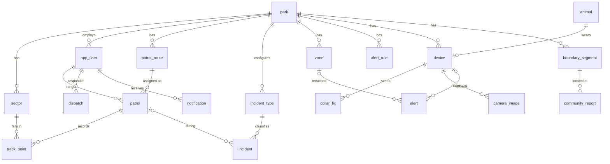

# WildX – Architecture

Technical design for [requirements.md](requirements.md). Requirement IDs (`PAT-05`, `CMN-04` …) are referenced throughout.
Guiding rule: **simplest thing that satisfies the requirement.** This is a prototype. Do not add layers, services or libraries that this document does not list without agreeing it with the team first.

---

## 1. Overview

```
 Phone browser (ranger / villager)          Desktop browser (manager / CLO / LEL)
            │  IndexedDB outbox + service worker        │
            └──────────────┬────────────────────────────┘
                           │ HTTPS JSON (JWT)
                 ┌─────────▼──────────┐       Simulators (curl / script)
                 │  Next.js frontend  │       collar fixes, camera images,
                 └─────────┬──────────┘       inbound SMS  ── X-Api-Key ──┐
                           │ REST /api/**                                  │
                 ┌─────────▼──────────────────────────────────────────────▼┐
                 │  Spring Boot monolith  (controllers → services → JPA)   │
                 │  @Scheduled jobs: escalation, device health             │
                 └─────────┬───────────────────────────┬───────────────────┘
                           │                           │
                     PostgreSQL                  ./uploads (photos/images)
```

- The system is **one backend and one frontend.** There are no microservices, no message broker and no WebSockets.
- **Real-time behaviour uses polling.** The dashboard polls every 15 s and notifications are polled every 30 s, which meets NFR-04.
- The **external systems are simulated** through REST endpoints protected by a static API key (§7).

## 2. Tech stack

| Layer | Choice | Notes |
|---|---|---|
| Backend | Spring Boot 4.1, Java 25, Maven | Already scaffolded in `backend/` |
| Persistence | Spring Data JPA + PostgreSQL | `ddl-auto=update` during development, with no migrations tool |
| Validation | `spring-boot-starter-validation` | `@Valid` on request DTOs |
| Auth | `spring-boot-starter-security` + `spring-boot-starter-oauth2-resource-server` | HS256 JWT issued by our own `/api/auth/login`, no external IdP |
| Boilerplate | Lombok | `@Getter @Setter` on entities, and Java `record` for DTOs |
| Frontend | Next.js 16 (App Router), React 19, TypeScript | ⚠ Read `frontend/AGENTS.md`, because Next 16 APIs differ from older versions |
| Styling | Tailwind CSS 4 | Mobile-first: write the base styles for phones and add `lg:` styles for the desktop dashboard |
| Maps | `leaflet` + `react-leaflet`, OpenStreetMap tiles | Load map components with `dynamic(..., { ssr:false })` |
| Offline storage | `idb-keyval` | The outbox and cached ranger data |
| Geometry | Hand-written `GeoUtil` (point-in-polygon, haversine) | **No PostGIS.** Polygons are stored as GeoJSON text |

The project adds **no other dependencies** without team agreement. Phone camera and GPS use native browser features: `<input type="file" accept="image/*" capture="environment">` and `navigator.geolocation.watchPosition`.

## 3. Key technical decisions

| # | Decision | Why / trade-off |
|---|---|---|
| D1 | A responsive web app replaces native mobile apps | One codebase. The trade-off is that GPS stops in the background when the screen is locked, which is a documented limitation |
| D2 | Offline ranger writes are stored locally first, in an IndexedDB **outbox**, and replayed in order | One mechanism serves every ranger write (fixes W17, CMN-04) |
| D3 | Each offline-created row has a client-generated `client_id` (UUID, unique), and the server upserts on it | Replays are idempotent, so nothing is stored twice (fixes W12, NFR-03) |
| D4 | Geometry is stored as GeoJSON in `TEXT` columns and checked in Java | No PostGIS install is needed. The data volumes are prototype-sized |
| D5 | Polling replaces WebSockets/SSE | It is simpler and works through any proxy. 15–30 s of latency is acceptable |
| D6 | **Dispatch** is one table with a polymorphic `(source_type, source_id)` | UC2, UC3 and UC4 all reuse one "Dispatch Responder" (CMN-06) |
| D7 | Incident types, alert rules, zones, sectors and segments are per-park data | A new park or hazard type needs no code change (fixes W4) |
| D8 | A validated community report **is** the conflict case, with no separate table | Its lifecycle is linear, so a second table would add nothing |
| D9 | Waypoints are track points with `is_waypoint=true` | There is one location model, with no duplicated GPS fields (fixes W12) |
| D10 | Files are stored on local disk (`wildx.upload-dir`), and the DB holds only the path | No object store is needed for the prototype |
| D11 | The JWT is kept in `localStorage` | Rangers need it while offline. This is acceptable for the prototype, and the trade-off against XSS exposure is noted |
| D12 | The SMS gateway is simulated: outbound SMS goes to the `sms_message` table and the log | Swapping in a real provider later only touches `SmsService` |

## 4. Backend structure

The backend keeps the existing layer packages under `com.wildx.wildx` and adds `controller` and `dto`. **Prefix each class name with its module** so the four devs rarely edit the same file.

```
com.wildx.wildx
├─ config/      SecurityConfig, JwtConfig, WebConfig (CORS), DataSeeder
├─ constant/    Roles, AppConstants (night hours, thresholds)
├─ controller/  AuthController, AdminController, Park*Controller,
│               Patrol*, Incident*, Dispatch*, Alert*, Device*, CameraImage*, Community*, Sms*, Report*
├─ dto/         request/response records, e.g. IncidentCreateRequest
├─ exception/   NotFoundException, BadRequestException, GlobalExceptionHandler (@RestControllerAdvice)
├─ mapper/      hand-written entity ↔ DTO mappers (static methods)
├─ model/       JPA entities (§5)
├─ repository/  Spring Data interfaces
├─ service/     business logic, @Transactional; *Job classes with @Scheduled
├─ type/        enums (Role, Severity, IncidentStatus, …)
└─ util/        GeoUtil, SmsParser
```

Each package's owner is shown in the requirements doc §3. The shared services have these owners:

| Shared service | Owner |
|---|---|
| `AuthService`, `ParkService` (parks, sectors) | UC1 |
| `DispatchService`, the outbox protocol | UC2 |
| `NotificationService` | UC3 |
| `SmsService` | UC4 |

Rules:
- Controllers stay thin and call services. A service may call another module's service, but **never another module's repository**.
- Every endpoint returns DTOs and never entities.
- Errors are returned as `{ "error": "message" }` with the right HTTP status from `GlobalExceptionHandler`.
- Every list is scoped to the caller's park. The server reads `parkId` from the JWT, except for Admin.

## 5. Database design (PostgreSQL)

All tables have `id BIGSERIAL PK` and `created_at TIMESTAMPTZ`. Location columns are always `lat DOUBLE, lng DOUBLE`. Geometry columns hold GeoJSON `TEXT`. Enums are stored as `VARCHAR` (`@Enumerated(STRING)`).

### 5.1 Relationships


`dispatch` links to `incident`, `alert` or `community_report` through `(source_type, source_id)`, which has no foreign key (D6).

### 5.2 Tables

**Shared / UC1**

| Table | Columns |
|---|---|
| `park` | name, code UNIQUE, boundary_geojson, neglect_days (7), duplicate_window_min (120), hotspot_threshold (5) |
| `sector` | park_id FK, name, polygon_geojson |
| `app_user` | park_id FK NULL (null for Admin), name, email UNIQUE, phone, password_hash, role, language (`en`/`si`/`ta`), active, on_duty, last_lat, last_lng, last_seen_at |
| `patrol_route` | park_id FK, name, path_geojson (LineString) |
| `patrol` | route_id FK, ranger_id FK, scheduled_date, status (`PLANNED/ACTIVE/COMPLETED/CANCELLED`), started_at, ended_at |
| `track_point` | **client_id UUID UNIQUE**, patrol_id FK, lat, lng, accuracy_m, recorded_at, sector_id FK NULL, is_waypoint, note |
| `notification` | user_id FK, title, body, link, read_at |
| `dispatch` | source_type (`INCIDENT/ALERT/COMMUNITY_REPORT`), source_id, responder_id FK, assigned_by FK, status (`ASSIGNED/ACKNOWLEDGED/COMPLETED/DECLINED`), assigned_at, acknowledged_at, completed_at, outcome, note |

**UC2**

| Table | Columns |
|---|---|
| `incident_type` | park_id FK, name, default_severity, active |
| `incident` | **client_id UUID UNIQUE**, park_id FK, type_id FK, reporter_id FK, patrol_id FK NULL, lat, lng, location_source (`GPS/MANUAL`), sector_id FK NULL, description, photo_path, severity, status (`NEW/ASSIGNED/RESOLVED/DISMISSED`), occurred_at (device time), resolution_note |

**UC3**

| Table | Columns |
|---|---|
| `animal` | park_id FK, name, species |
| `device` | park_id FK, type (`COLLAR/CAMERA`), code UNIQUE, animal_id FK NULL, lat, lng (camera), expected_interval_min, battery_pct, last_seen_at |
| `zone` | park_id FK, name, type (`FARMLAND/ROAD/VILLAGE_BUFFER/RESTRICTED`), polygon_geojson |
| `alert_rule` | park_id FK, zone_type, severity, cooldown_min, ack_sla_min — UNIQUE(park_id, zone_type) |
| `collar_fix` | device_id FK, lat, lng, battery_pct, recorded_at — UNIQUE(device_id, recorded_at) |
| `alert` | park_id FK, type (`ZONE_BREACH/MORTALITY/DEVICE_HEALTH/HUMAN_DETECTED`), severity, device_id FK NULL, zone_id FK NULL, camera_image_id FK NULL, lat, lng, status (`OPEN/ACKNOWLEDGED/RESOLVED`), escalation_level (0..2), sla_due_at, acknowledged_by FK, acknowledged_at, resolved_at, disposition |
| `camera_image` | device_id FK, file_path, content_hash UNIQUE, captured_at, status (`PENDING/TAGGED/EMPTY/UNIDENTIFIABLE/RESTRICTED`), species, count, reviewed_by FK, reviewed_at |
| `audit_log` | user_id FK, action, entity, entity_id, reason |

**UC4**

| Table | Columns |
|---|---|
| `boundary_segment` | park_id FK, name, code UNIQUE per park (SMS landmark), center_lat, center_lng |
| `community_report` | reference_code UNIQUE (`R-1042`), park_id FK, segment_id FK NULL, channel (`SMS/WEB`), reporter_phone, type (`SIGHTING/CROP_DAMAGE/OTHER`), animal_count, description, photo_path, lat, lng, raw_text, status (`NEW/NEEDS_LOCATION/DUPLICATE/VALIDATED/DISPATCHED/CLOSED/INVALID`), duplicate_of_id FK NULL, severity, invalid_reason, outcome, closed_at |
| `sms_message` | direction (`IN/OUT`), phone, body, related_report_id NULL |

The enums live in `type/`:
- `Role`: RANGER, SUPERVISOR, MANAGER, CLO, LEL, ADMIN
- `Severity`: LOW, MEDIUM, HIGH, CRITICAL
- Disposition: CONFLICT_AVERTED, CONFLICT_OCCURRED, NO_ACTION, FALSE_ALARM

## 6. REST API

Every path starts with `/api` and needs a JWT, except where a row says **public** or **api-key**. Roles are enforced with `@PreAuthorize`.

| Module | Endpoint | Who |
|---|---|---|
| Auth | `POST /auth/login` → `{token, user}` | public |
| Admin | `GET/POST/PUT /admin/parks`, `GET/POST/PUT /admin/users` | ADMIN |
| Park config | `GET/POST/PUT/DELETE /parks/{id}/sectors\|zones\|alert-rules\|incident-types\|segments\|devices\|animals` | MANAGER (writes), staff (reads) |
| UC1 | `GET/POST /routes`, `POST /patrols` (assign), `GET /patrols?status=&date=` | MANAGER, SUPERVISOR |
| UC1 | `GET /me/patrols` | RANGER |
| UC1 | `POST /patrols/{id}/start` `{at}`, `POST /patrols/{id}/end` `{at}` | RANGER, idempotent |
| UC1 | `POST /patrols/{id}/points` `[{clientId, lat, lng, accuracyM, recordedAt, isWaypoint, note}]` | RANGER, batch upsert |
| UC1 | `GET /patrols/{id}/track`, `GET /monitor/live`, `GET /monitor/coverage` | SUPERVISOR, MANAGER |
| UC2 | `POST /incidents` (multipart: `data` JSON + `photo`), `GET /incidents?status=&type=&severity=`, `GET /incidents/{id}`, `PATCH /incidents/{id}` (severity), `POST /incidents/{id}/dismiss` | RANGER creates, SUPERVISOR/MANAGER triage |
| Shared | `POST /dispatches` `{sourceType, sourceId, responderId}`, `GET /me/dispatches`, `POST /dispatches/{id}/acknowledge\|complete\|decline` | — |
| Shared | `GET /responders?lat=&lng=`, which returns on-duty rangers sorted by distance | — |
| Shared | `GET /me/notifications`, `POST /notifications/{id}/read` | any |
| UC3 | `GET /alerts?status=`, `POST /alerts/{id}/acknowledge`, `POST /alerts/{id}/resolve` `{disposition}` | staff |
| UC3 | `GET /camera-images?status=`, `POST /camera-images/{id}/tag`, `GET /camera-images/{id}/file?reason=` (audited if restricted) | MANAGER, LEL (restricted) |
| UC3 sim | `POST /ingest/collar-fixes`, `POST /ingest/camera-images` (multipart) | **api-key** |
| UC4 | `POST /public/reports` (multipart), `GET /public/reports/{ref}`, `GET /public/parks/{id}/segments` | **public** |
| UC4 sim | `POST /ingest/sms` `{from, body}` → `{reply}` | **api-key** |
| UC4 | `GET /community-reports?status=`, `POST /community-reports/{id}/validate` `{severity}`, `POST /community-reports/{id}/invalidate` `{reason}`, `GET /community/hotspots` | CLO, MANAGER |
| Reports | `GET /reports/coverage\|incidents\|alerts\|conflicts?from=&to=` (`&format=csv`) | MANAGER, SUPERVISOR |
| Files | `GET /files/{path}` for incident and report photos | staff |

**Dispatch side-effects:** completing a dispatch updates its source.
- Incident → `RESOLVED`
- Alert → `RESOLVED` with a disposition
- Community report → `CLOSED`, followed by a villager SMS or status update

`DispatchService` delegates each update through a `switch` on `source_type`.

## 7. Key flows (implementation)

### 7.1 Synchronize Pending Data (CMN-04, shared by UC1 and UC2)
1. A ranger action calls `outbox.add({method, path, body | formFields + blob})`. The entry is written to IndexedDB and the UI shows *Pending* straight away.
2. `outbox.flush()` runs on app load, on the `online` event and every 30 s. It sends the entries in FIFO order, one at a time.
3. A `2xx` or `409` response removes the entry. A network error stops the flush, which is retried later. Any other `4xx` marks the entry *Failed* in the sync bar, where the ranger can retry or discard it.
4. On the server, `POST /incidents` and `/points` look up `client_id` first. If the record already exists, the server returns it unchanged.
5. The ranger app caches `GET /me/patrols` (with route geometry) and the incident types in IndexedDB, so the patrol and incident screens work offline.

### 7.2 Collar fix → alert (SEN-04 to SEN-09)
1. `POST /ingest/collar-fixes` → validate the fix, then `INSERT … ON CONFLICT DO NOTHING`. A duplicate returns `200` and processing stops.
2. Update the `device`'s `last_seen_at` and `battery_pct`.
3. For each `zone` of the park, if `GeoUtil.contains(zone, lat, lng)`:
   - load the `alert_rule` for the zone type;
   - skip if an alert for the same device and zone was raised within `cooldown_min`;
   - set the severity from the rule, raised one level between 18:00 and 06:00;
   - set `sla_due_at = now + ack_sla_min`;
   - save the alert, then notify on-duty rangers and send SMS fallback where it applies.
4. `AlertEscalationJob` runs `@Scheduled(fixedRate = 60s)`. For each `OPEN` alert past `sla_due_at` with `escalation_level < 2`, it increments the level, notifies `ESCALATION_CHAIN[level]` (SUPERVISOR, then MANAGER) and sets `sla_due_at += ack_sla_min`.
5. `DeviceHealthJob` runs every 10 min. It raises a health alert when `last_seen_at < now − 3×interval` or the battery is below 15%, and a mortality alert when a collar's fixes in the last 6 h all lie within 50 m. It never raises a second alert while one is already open for the same device and type.

### 7.3 Inbound SMS (COM-03 to COM-05)
1. `SmsParser.parse(body)` uppercases the text, splits it on whitespace and maps the tokens:
   - `[0]` → type, using the keyword table below;
   - `[1]` → landmark code;
   - `[2]` → count, if it is numeric.
2. If the message is unparseable, the system replies with the help text and stops.
3. Find the segment by `code` in any park. If no code matches, the report is stored with status `NEEDS_LOCATION`.
4. Run the duplicate check for the same segment, status `NEW`/`VALIDATED`/`DISPATCHED`, and `created_at` within `duplicate_window_min`.
5. Save the report with a generated reference code, notify the park's CLOs, log both SMS messages and return the reply.

| Type | English | Sinhala (translit.) | Tamil (translit.) |
|---|---|---|---|
| SIGHTING | `ELE` | `ALI` | `YANAI` |
| CROP_DAMAGE | `CROP` | `GOVI` | `PAYIR` |
| OTHER | `HELP` | `UDAW` | `UTHAVI` |

Help reply: `WildX: send TYPE LANDMARK COUNT e.g. ELE KUMB 3. Types: ELE/ALI/YANAI, CROP/GOVI/PAYIR.`

### 7.4 Coverage and hotspots (computed with queries and never stored)
- **Coverage** is `SELECT sector_id, MAX(recorded_at) FROM track_point JOIN patrol … GROUP BY sector_id`. A sector is neglected when this value is NULL or older than `park.neglect_days`.
- **Hotspots** are the segments that meet `COUNT(*)` of validated, dispatched or closed reports in the last 30 days `>= park.hotspot_threshold`.

## 8. Frontend structure

```
frontend/
├─ app/
│  ├─ login/page.tsx
│  ├─ ranger/                 # phone-first; role RANGER
│  │  ├─ layout.tsx           # sync bar + bottom nav (Patrols, Report, Tasks, Alerts)
│  │  ├─ page.tsx             # my patrols today
│  │  ├─ patrol/[id]/page.tsx # map, Start/End, Waypoint, Report incident
│  │  ├─ incident/new/page.tsx
│  │  ├─ tasks/page.tsx       # my dispatches + my incidents
│  │  └─ alerts/page.tsx      # notifications, acknowledge
│  ├─ dashboard/              # desktop-first, responsive; staff roles
│  │  ├─ layout.tsx           # side nav (collapses to top menu on phone), notification bell
│  │  ├─ page.tsx             # live map: patrols + open alerts + new incidents + hotspots
│  │  ├─ patrols/  routes/  coverage/          # UC1
│  │  ├─ incidents/                            # UC2
│  │  ├─ alerts/  images/  devices/            # UC3
│  │  ├─ community/                            # UC4
│  │  ├─ reports/                              # all four reports, tabs
│  │  └─ settings/            # sectors, zones, alert rules, incident types, segments (GeoJSON paste)
│  ├─ admin/                  # parks, users
│  └─ report/                 # PUBLIC villager form; [ref]/page.tsx = status
├─ components/                # Map (Leaflet), SyncBar, StatusBadge, SeverityBadge, BigButton, PickList, DispatchDialog
├─ lib/
│  ├─ api.ts                  # fetch wrapper: base URL, JWT header, JSON errors
│  ├─ auth.ts                 # token + user in localStorage, useUser(), role guard
│  ├─ outbox.ts               # add / flush / list (idb-keyval)
│  ├─ geo.ts                  # watchPosition wrapper (60 s / 50 m)
│  └─ i18n.ts                 # { en, si, ta } dictionaries + useT()
└─ public/sw.js               # service worker (NFR-02)
```

- **Service worker:** `public/sw.js` is hand-written and about 40 lines long, and it is registered from `ranger/layout.tsx`.
  - `/ranger/**` pages and static assets use cache-first.
  - OSM tiles use cache-first, so tiles the ranger has already viewed are available offline.
  - `GET /api/me/*` uses network-first with a cache fallback.
  - Check `node_modules/next/dist/docs/` for the Next 16 PWA guidance before writing it.
- **Role guard:** each top-level layout redirects the user to `/login` if their role does not match. The backend is the real enforcement.
- **Data fetching** uses plain `fetch` in client components with `setInterval` polling. There is no state library and no React Query.
- **Status and severity** are always shown as **text plus a colour**, never colour alone.
- **Mobile UI:** use `min-h-12` (48 px) for tap targets and the `text-base`/`text-lg` text sizes. The primary action is a full-width button pinned to the bottom of the screen.

## 9. Configuration and local setup

`backend/src/main/resources/application.properties`:
```properties
spring.datasource.url=jdbc:postgresql://localhost:5432/wildx
spring.datasource.username=wildx
spring.datasource.password=wildx
spring.jpa.hibernate.ddl-auto=update
spring.servlet.multipart.max-file-size=10MB
wildx.jwt-secret=change-me-32-bytes-minimum-dev-secret!!
wildx.ingest-api-key=dev-ingest-key
wildx.upload-dir=./uploads
wildx.cors-origin=http://localhost:3000
```
Frontend `.env.local`: `NEXT_PUBLIC_API_URL=http://localhost:8080/api`.

To run the system, start PostgreSQL, the backend and the frontend:

```bash
docker run -d --name wildx-db -e POSTGRES_USER=wildx -e POSTGRES_PASSWORD=wildx -e POSTGRES_DB=wildx -p 5432:5432 postgres:17
```

```bash
cd backend && ./mvnw spring-boot:run
```

```bash
cd frontend && npm run dev
```

**Seed data:** `config/DataSeeder` runs only when the DB is empty. It creates:
- park **Yala**, with 4 sectors, 2 routes and 2 zones (Kumbukgaha farmland, and a road);
- alert rules, 5 incident types and 3 boundary segments (`KUMB`, `PAL`, `KAT`);
- 1 collar on elephant "Gemunu" and 1 camera;
- one user per role, with the test password `password`.

Simulation scripts live in `docs/sim/*.http` (IntelliJ/VS Code REST client) and send a fix inside the farmland zone, a camera image and an SMS.

## 10. Testing

The project keeps tests small and puts them where the logic is:
- JUnit tests for `GeoUtil`: inside/outside a polygon and haversine distance.
- JUnit tests for `SmsParser`: every keyword, the help path and a missing count.
- `@DataJpaTest` or service tests for:
  - collar fix → alert, covering the cool-down and the night-time severity rise;
  - escalation steps;
  - incident `client_id` idempotency;
  - the community report duplicate check.
- Frontend: manual run-through of every flow in requirements.md §5–8 at a 360 px viewport, with DevTools network set to *Offline* for F1.2 and F2.1.

## 11. Conventions

- **Git:**
  - Branch names: `uc1/…`, `uc2/…`, `uc3/…`, `uc4/…`, `common/…`.
  - Commits use conventional commits and mention requirement IDs, e.g. `feat(uc2): offline incident submit [INC-04]`.
  - PRs go into `main` and need one teammate's review.
- **API naming:**
  - JSON uses camelCase.
  - Timestamps are ISO-8601 UTC, and the device's time is sent for offline records.
  - IDs are numbers, except `clientId`, which is a UUID string.
- **Changes to this document:** any change to a shared table, enum or endpoint must update this document in the same PR.
